# Form Recognizer with Azure Functions

## Pre-Requisites  
* [Python 3](https://www.python.org/downloads/)
   * [Virtual Python Environment Builder](https://pypi.org/project/virtualenv/)
* [Visual Studio Code](https://code.visualstudio.com/)
    * [Python Extension for Visual Studio Code](https://marketplace.visualstudio.com/items?itemName=ms-python.python)
    * [Azure Account Extension for Visual Studio Code](https://marketplace.visualstudio.com/items?itemName=ms-vscode.azure-account)
    * [Azure Functions Extension for Visual Studio Code](https://marketplace.visualstudio.com/items?itemName=ms-azuretools.vscode-azurefunctions)
* [Docker Desktop](https://www.docker.com/products/docker-desktop)
* [Postman](https://www.getpostman.com/)
* [Azure Storage Account](https://docs.microsoft.com/en-us/azure/storage/common/storage-quickstart-create-account?tabs=azure-portal)
* [Form Recognizer Resource](https://docs.microsoft.com/en-us/azure/cognitive-services/form-recognizer/overview)
* [Trained Form Recognizer Model](https://docs.microsoft.com/en-us/azure/cognitive-services/form-recognizer/quickstarts/python-train-extract)

## Environment Setup
1. Azure Portal > Create a Function App
   * **App name:** Provide your Function App a unique name
   * **Resource Group:** Create a new or select an existing Resource Group
   * **Operating System:** Linux
   * **Hosting Plan:** Consumption
   * **Location:** Select a Location (e.g. West Europe)
   * **Runtime Stack:** Python
   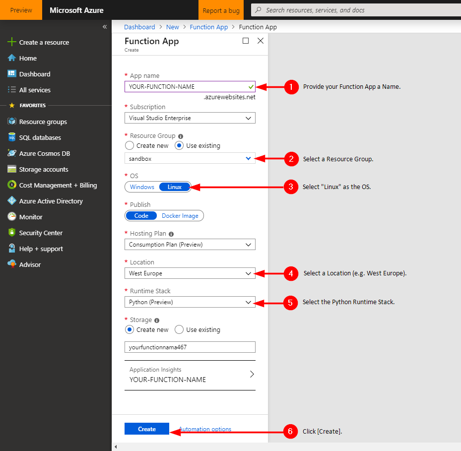

2. Visual Studio Code > Create a New Virtual Envrionment (Python).
    * Open Visual Studio Code
    * Open the folder that you would like to work from
    * Terminal: ```virtualenv .``` (this will create a virtual environment)
    * Terminal: ```.\Scripts\activate``` (this will activate the virtual environment)

       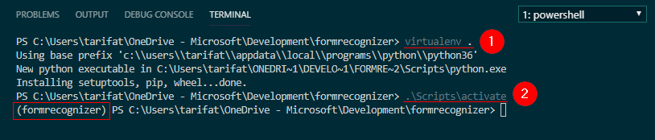

3. Press: Ctrl + SHIFT + P
4. Search "Create New Project", Select **"Azure Functions: Create New Project"**
   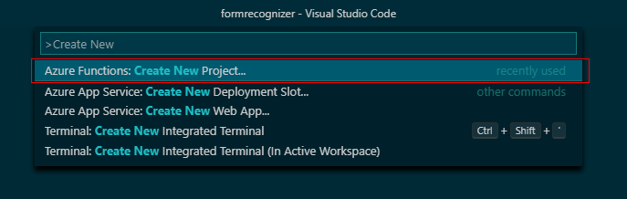
5. Select the folder to deploy the Azure Function project to.
   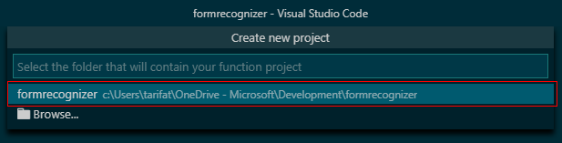
6. Select **Python** as the language for your Azure Function project.
   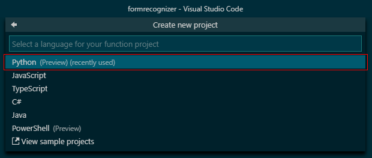
7. Select **HTTP trigger** as the template for your projects function.
   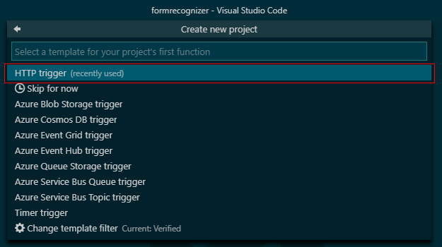
8. Provide the function a name (e.g. AnalyzeForm).
   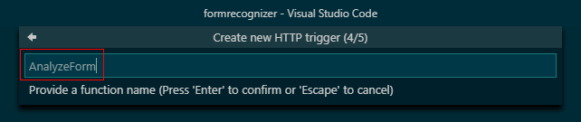
9. Select the **Function** authorization level.
   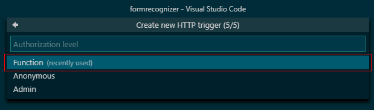

## Python Library Requirements
* Run the following command in your activated environment via Terminal: ```pip install azure-storage-blob```  
   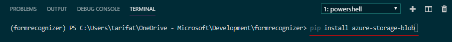
* Add the following line to **requirements.txt**: ```azure-storage-blob==1.4.0```  
   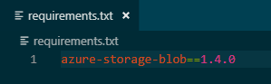

## Python Code Sample
This can be copy and pasted into **\_\_init\_\_.py**
```python
import requests
import logging
import azure.functions as func
from azure.storage.blob import BlockBlobService

SUPPORTED_CONTENT_TYPES = ['application/pdf', 'image/jpeg', 'image/png']

def main(req: func.HttpRequest) -> func.HttpResponse:
    # 1. Get Header Values - Azure Blob Storage
    storage_account_name = req.headers.get('storage_account_name')
    storage_account_key = req.headers.get('storage_account_key')
    container_name = req.headers.get('container_name')
    blob_name = req.headers.get('blob_name')

    # 2. Get Header Values - Form Recognizer Cognitive Service
    region = req.headers.get('region')
    model_id = req.headers.get('model_id')
    subscription_key = req.headers.get('subscription_key')
    
    # 3. Get Form from Blob Storage
    blob_service = BlockBlobService(account_name=storage_account_name, account_key=storage_account_key)
    blob = blob_service.get_blob_to_bytes(container_name, blob_name)
    data = blob.content
    content_type = blob.properties.content_settings.content_type

    body = None
    if content_type in SUPPORTED_CONTENT_TYPES:

        # 4. Generate Endpoint and HTTP Header
        endpoint = 'https://{0}.api.cognitive.microsoft.com/formrecognizer/v1.0-preview/custom/models/{1}/analyze'.format(region, model_id)
        headers = {
            'Content-Type': content_type,
            'Ocp-Apim-Subscription-Key': subscription_key
        }

        # 5. Analyze Form
        response = requests.post(endpoint, headers=headers, data=data)
        body = response.content

    # 6. Return HTTP Response
    return func.HttpResponse(body,headers={'Content-Type':'application/json'})
```

## Test the Azure Function Locally using Postman
1. Execute the following command in Terminal to launch the functions runtime host: ``func start``
2. Open Postman and create a new request with the following properties:
   * Method: GET
   * URL: ``http://localhost:7071/api/YOUR_FUNCTION_NAME``
3. Add the following Headers:  

    | Key | Value |
    | ------------- | ------------- |
    | storage_account_name | ```STORAGE_ACCOUNT_NAME``` |
    | storage_account_key | ```STORAGE_ACCOUNT_KEY``` |
    | container_name | ```STORAGE_CONTAINER_NAME``` |
    | blob_name | ```STORAGE_BLOB_NAME``` |
    | region | ```FORM_RECOGNIZER_RESOURCE_REGION``` |
    | model_id | ```FORM_RECOGNIZER_MODEL_ID``` |
    | subscription_key | ```FORM_RECOGNIZER_SUBSCRIPTION_KEY``` |

4. Click **Send**

If successful, this should return the results of the form being processed by the Analyze Form Recognizer API.

   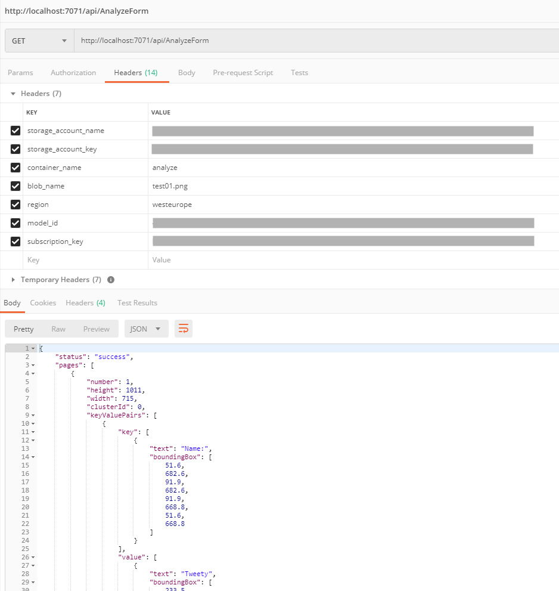

## Publish the Azure Function
Execute the following terminal command to publish the current directory contents to an Azure Function App:  
```func azure functionapp publish NAME_OF_YOUR_FUNCTION_APP --build-native-deps```  

Check out [https://aka.ms/func-python-publish](https://aka.ms/func-python-publish) for more information on publishing a Python function to Azure.

## Test the Azure Function
Once the deployment has completed successfully, a public **invoke url** will be returned to the terminal window. 
1. Copy the **invoke url** to the clipboard.
2. Return to **Postman** and duplicate the existing request by right-clicking on the tab and clicking **Duplicate Tab**.
3. Replace the http://localhost/api/YOUR_FUNCTION_NAME with the **invoke url**.
4. Click **Send**

   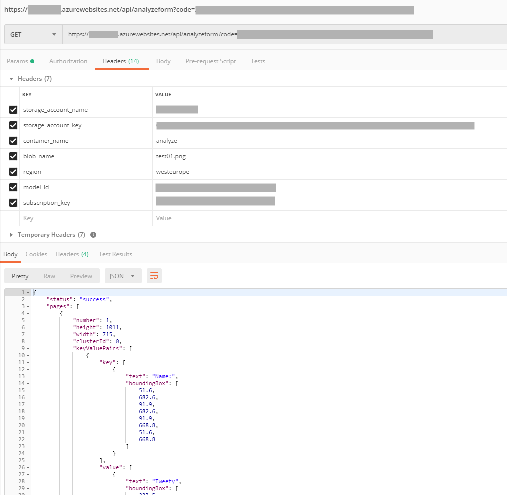

That's it! If successful, this should return the same results as before but this time, the function will be running in the cloud. We now have a serverless method of processing forms stored on Azure Blob Storage using Azure Functions.